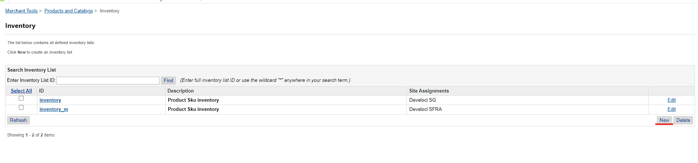
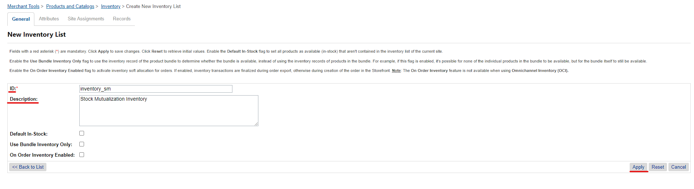
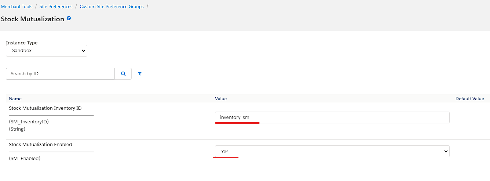
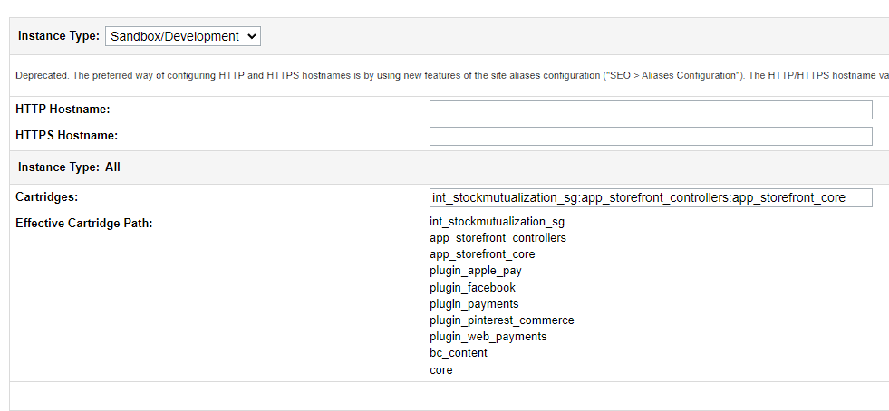

# Stock Mutualization Documentation #

This integration implements a second inventory verification, to allow for a centralized stock. By default, the Salesforce platform only allows for a Site Inventory and Store Inventories. With Stock Mutualization, it's possible to have a central inventory as back-up, which is useful for brands that have multiple sites based on locale.

SFRA version tested against v6.3.0 and SiteGenesis v105.2.1. Compatibility mode: from 19.10 to 22.7

## Implementation Guides ##

1. [Installation Guide SFRA Cartridge](#SFRA)
2. [Installation Guide SiteGenesis Cartridge](#SiteGenesis)

### Installation Guide SFRA Cartridge ###

#### Import Cartridge ####

- Import **int_stockmutualization_sfra** into your workspace.
- Modify the Cartridge Path in **Administration > Manage Sites > 'Your Site' > Settings**
- Make sure the cartridge is right before **app_storefront_base**

#### Import Metadata ####

- Locate the folder **stock_mutualization_metadata** inside the **metadata** folder and compress it to a zip file as **stock_mutualization_metadata.zip**
- Log in to Business Manager
- Navigate to **Administration > Site Development > Site Import & Export**
- Use the upload control to browse the **stock_mutualization_metadata.zip** file
- Click on **Upload**
- Select **stock_mutualization_metadata.zip** and click on Import, press OK on the confirmation alert. Import should complete successfully.

#### Set up Stock Mutualization Inventory ####

- Navigate to **Merchant Tools > Products and Catalogs > Inventory**
- Create a new Inventory List for Stock Mutualization

#### Configure Stock Mutualization Preferences ####

- Navigate to **Merchant Tools > Custom Preferences > Stock Mutualization**
- Set the **Stock Mutualization Inventory ID** to the ID of the new created Inventory List
- Set **Stock Mutualization Enabled** to **Yes**

#### Product Inventory Configuration ####

- For Stock Mutualization to be enabled for each Product, it needs to have Inventory Allocation for the Stock Mutualization Inventory List. Set up the Site's Inventory Management System to account for that
- ***Bundles*** in specific need to have allocation set up for *both* the Products *and* the Bundle itself

#### Placing Orders ####

- When adding Products to the **Cart**, first it'll check the Site's *Assigned Inventory*, before checking the *Stock Mutualization Inventory*
- If the Site Inventory has enough for the quantity requested, it'll simply add the Product to the Cart normally
- If the Site Inventory has *no stock available*, it'll check the *Stock Mutualization Inventory*, and add from there if it has stock
- ***Exceptionally***, in case the quantity requested is **higher** than the stock available on the *Site Inventory*, it'll add whatever is available from it, and the **remaining** will come from the *Stock Mutualization Inventory*. This will cause the cart to have *split* LineItems, to differentiate between Inventories

### Installation Guide SiteGenesis Cartridge ###

#### Import Cartridge ####

- Import **int_stockmutualization_sg** into your workspace.
- Modify the Cartridge Path in **Administration > Manage Sites > 'Your Site' > Settings**
- Make sure the cartridge is right before **app_storefront_controllers** and **app_storefront_core**

#### Import Metadata ####

- Locate the folder **stock_mutualization_metadata** inside the **metadata** folder and compress it to a zip file as **stock_mutualization_metadata.zip**
- Log in to Business Manager
- Navigate to **Administration > Site Development > Site Import & Export**
- Use the upload control to browse the **stock_mutualization_metadata.zip** file
- Click on **Upload**
- Select **stock_mutualization_metadata.zip** and click on Import, press OK on the confirmation alert. Import should complete successfully.

#### Set up Stock Mutualization Inventory ####

- Navigate to **Merchant Tools > Products and Catalogs > Inventory**
- Create a new Inventory List for Stock Mutualization

#### Configure Stock Mutualization Preferences ####

- Navigate to **Merchant Tools > Custom Preferences > Stock Mutualization**
- Set the **Stock Mutualization Inventory ID** to the ID of the new created Inventory List
- Set **Stock Mutualization Enabled** to **Yes**

#### Product Inventory Configuration ####

- For Stock Mutualization to be enabled for each Product, it needs to have Inventory Allocation for the Stock Mutualization Inventory List. Set up the Site's Inventory Management System to account for that
- ***Bundles*** in specific need to have allocation set up for *both* the Products *and* the Bundle itself

#### Placing Orders ####

- When adding Products to the **Cart**, first it'll check the Site's *Assigned Inventory*, before checking the *Stock Mutualization Inventory*
- If the Site Inventory has enough for the quantity requested, it'll simply add the Product to the Cart normally
- If the Site Inventory has *no stock available*, it'll check the *Stock Mutualization Inventory*, and add from there if it has stock
- ***Exceptionally***, in case the quantity requested is **higher** than the stock available on the *Site Inventory*, it'll add whatever is available from it, and the **remaining** will come from the *Stock Mutualization Inventory*. This will cause the cart to have *split* LineItems, to differentiate between Inventories

#### Notes ####
In case your Site's Cartridge path is replacing by priority any file used on Stock Mutualization cartridges (int_stockmutualization_sfra, int_stockmutualization_sg) make sure to copy our code and make it available on the new cartridge in the priority Path. Based on SFCC architecture.
