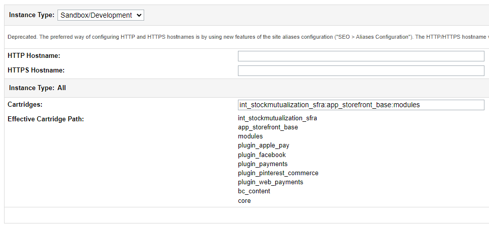
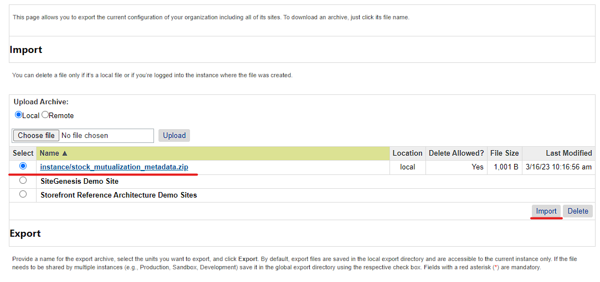
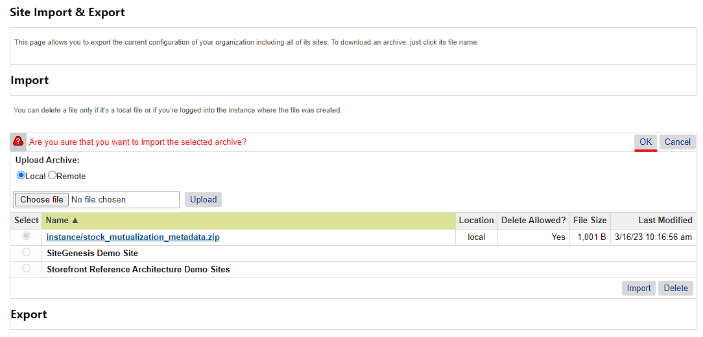

# Stock Mutualization Documentation #

This integration implements a second inventory verification, to allow for a centralized stock. By default, the Salesforce platform only allows for a Site Inventory and Store Inventories. With Stock Mutualization, it's possible to have a central inventory as back-up, which is useful for brands that have multiple sites based on locale.

SFRA version tested against v6.3.0 and SiteGenesis v105.2.1. Compatibility mode: from 19.10 to 22.7

## Implementation Guides ##

1. [Installation Guide SFRA Cartridge](#SFRA)
2. [Installation Guide SiteGenesis Cartridge](#SiteGenesis)

### Installation Guide SFRA Cartridge ###

#### Import Cartridge ####

- Import **int_stockmutualization_sfra** into your workspace.
- Modify the Cartridge Path in **Business Manager > Administration > Manage Sites > 'Your Site' > Settings**
- Make sure the cartridge is right before **app_storefront_base**

#### Import Metadata ####

- Locate the folder **stockmutualization_metadata** inside the **metadata** folder and compress it to a zip file as **stockmutualization_metadata.zip**
- Log in to Business Manager
- Click on **Administration > Site Development > Site Import & Export**
- Use the upload control to browse the **stockmutualization_metadata.zip** file
- Click on **Upload**
- Select **stockmutualization_metadata.zip** and click on Import, press OK on the confirmation alert. Import should complete successfully.

#### Set up Stock Mutualization Inventory ####

#### Configure Stock Mutualization Preferences ####

#### Product Inventory Configuration ####

#### Placing Orders ####

### Installation Guide SiteGenesis Cartridge ###

#### Import Cartridge ####

- Import **int_stockmutualization_sg** into your workspace.
- Modify the Cartridge Path in **Business Manager > Administration > Manage Sites > 'Your Site' > Settings**
- Make sure the cartridge is right before **app_storefront_controllers** and **app_storefront_core**

![Modifying Cartridge Path]

#### Import Metadata ####

- Locate the folder **stockmutualization_metadata** inside the **metadata** folder and compress it to a zip file as **stockmutualization_metadata.zip**
- Log in to Business Manager
- Click on **Administration > Site Development > Site Import & Export**
- Use the upload control to browse the **stockmutualization_metadata.zip** file
- Click on **Upload**
- Select **stockmutualization_metadata.zip** and click on Import, press OK on the confirmation alert. Import should complete successfully.

#### Set up Stock Mutualization Inventory ####

#### Configure Stock Mutualization Preferences ####

#### Product Inventory Configuration ####

#### Placing Orders ####

#### Notes ####
In case your Site's Cartridge path is replacing by priority any file used on Stock Mutualization cartridges (int_stockmutualization_sfra, int_stockmutualization_sg) make sure to copy our code and make it available on the new cartridge in the priority Path. Based on SFCC architecture.
